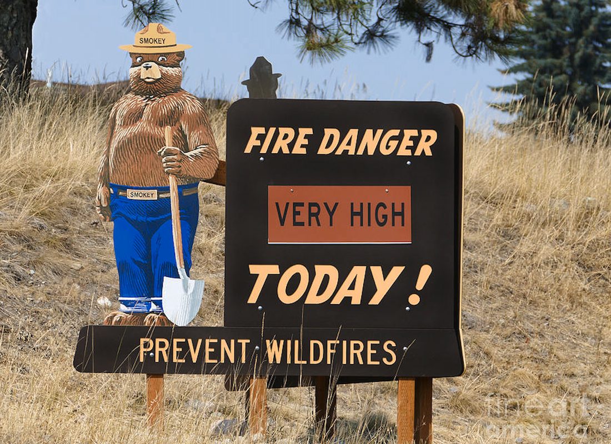

   

# Wildfire Prediction

This project is a part of Disaster Response Hackaton. Take a look at [this on the hackaton page](https://devpost.com/software/wildfire-disaster)!

The project is to provide first responders, Firefighters, and Firefighting Command Centers, an AI app that can be used to predict wildfire occurrence, and help save lives and property. 

The notebooks can be used to build and train an ML model that can predict wildfires using history fire readings and weather data. 

# Structure
This repo has the following structure:
* **Wildfire architecture.pdf**: an scheme of the project architecture. It gives a high-level view of the project
* **/notebooks**: contains the following:
    * **aws-wildfire-eda-0-step_cl**: EDA to understand the given data
    * **aws-wildfire-datapreparation-step1**: Processing fire data retrieved from NASA FIRMS
    * **aws-aus-wildfire-datapreparation-step2**: Extract fire data belonging only to Australia
    * **aws-aus-data-preparation-step-2-2**: Prepare fire data for ML model, build new features using history data in 2012-2021
    * **aws-find-weather-stations-and-create-data-step3**: Retrieve weather data from [NCEI NOAA](https://www.ncei.noaa.gov/)
    * **aws-merge-aus-fire-data-with-weather-step4**: Merge fire readings with weather data
    * **aws-aus-wildfire-prediction-step5**: Build an ML model for wildfire prediction

# Credits

1 Dataset [NCEI NOAA](https://www.ncei.noaa.gov/)National Centers for Environmental Information  
2 Dataset [MODIS](https://earthdata.nasa.gov/earth-observation-data/near-real-time/firms/c6-mcd14dl) Collection 6.1: Temporal Coverage: 11 November 2000 - present 
3 Dataset [VIIRS](https://ncc.nesdis.noaa.gov/VIIRS/) S-NPP 375m: Temporal Coverage: 20 January 2012 - present 
4 Dataset [VIIRS NOAA-20](https://ncc.nesdis.noaa.gov/NOAA-20/NOAA20VIIRS.php) 375m: Temporal Coverage: 1 January 2020 - present